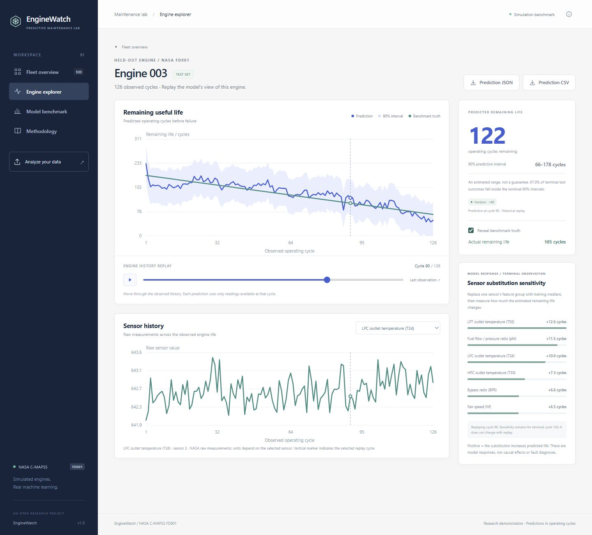
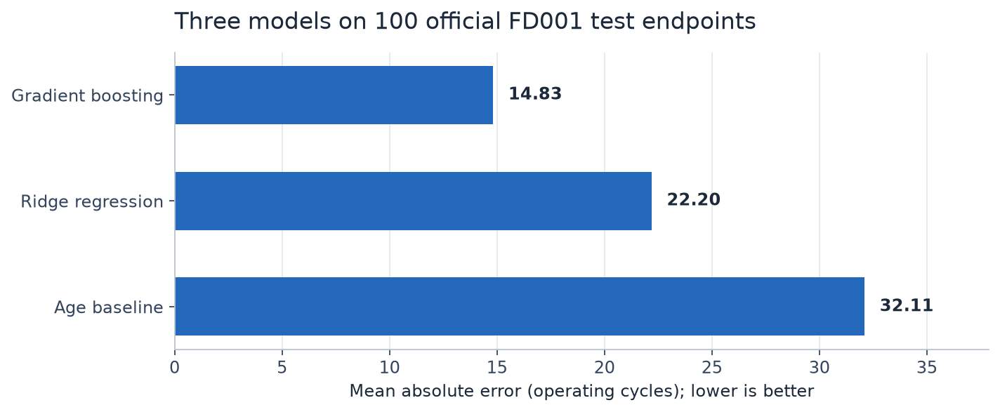
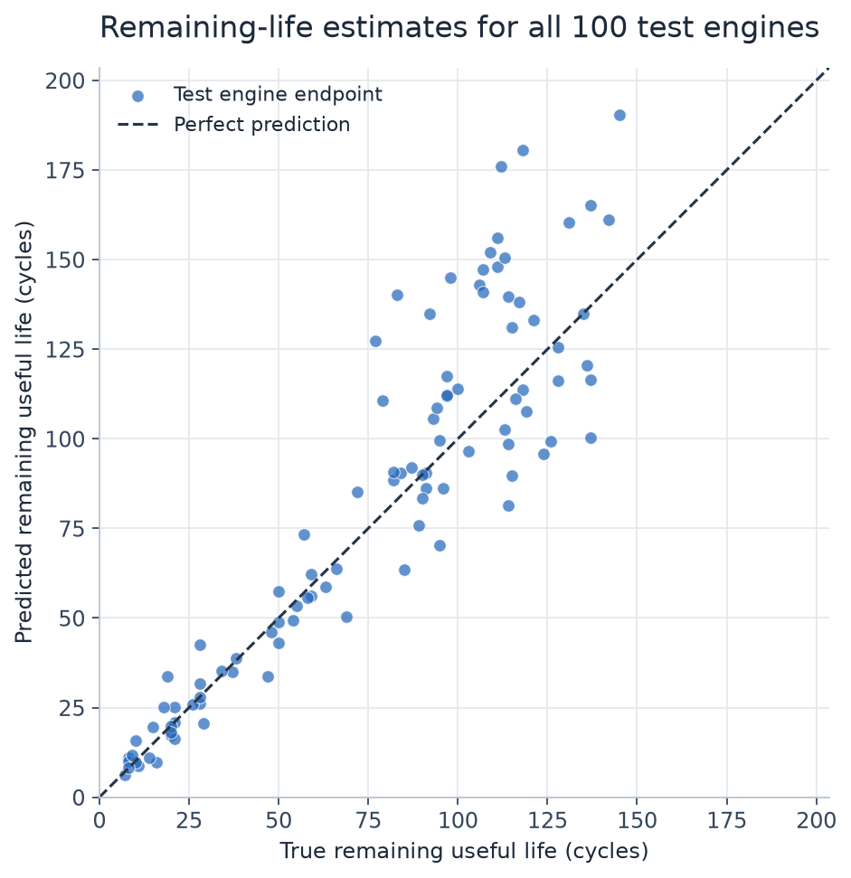
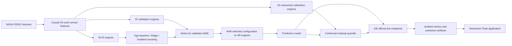

# EngineWatch

### Explainable remaining-life forecasting for a simulated jet-engine fleet

[](https://www.python.org/)
[](LICENSE)
[](https://doi.org/10.5281/zenodo.15346912)

**From noisy sensor histories to an inspectable prediction.** EngineWatch estimates how many operating cycles a simulated turbofan engine has left, displays its prediction interval, then lets you replay the history behind that estimate.

The shipped experiment achieves **14.83 cycles MAE** on 100 official test-engine endpoints, a **53.8% reduction** from an age-only baseline. Every number in this README comes from the included training run and is independently recalculated in the [executed notebook](notebooks/enginewatch_analysis.ipynb).



## Explore the experiment

- **Fleet view:** compare all 100 test engines and see which predictions fall near the demonstration thresholds.
- **Engine replay:** select an engine and move through its available operating history. Its lifetime estimate, interval and sensor charts update together.
- **Terminal sensor sensitivity:** see the change in predicted cycles at the final available observation when a sensor's feature group is replaced with typical fitting-data values. This view stays fixed during replay and labels its endpoint cycle.
- **Measured evidence:** inspect an age-only baseline, regularised linear model, and nonlinear model on the same held-out endpoints.
- **Reproducible training:** download validated source data, train on whole-engine splits, calibrate intervals independently, and regenerate every app artifact using one command.

This is a research and portfolio project using **simulated data**. It has not been validated on physical aircraft. Its display thresholds are illustrative and do not authorize a maintenance decision.

## Run locally

Python **3.11 or newer** is required; the supplied run was produced with Python 3.12. Clone or download this repository, then open a terminal in its root. The app uses the included prediction artifacts, so its first launch does not require training or a network request.

**Windows (PowerShell)**

```powershell
python -m venv .venv
.\.venv\Scripts\python.exe -m pip install -e ".[dev,notebook]"
.\.venv\Scripts\python.exe app.py
```

**macOS / Linux**

```bash
python3 -m venv .venv
source .venv/bin/activate
python -m pip install -e ".[dev,notebook]"
python app.py
```

Open **[http://127.0.0.1:5050](http://127.0.0.1:5050)**. The default server binds to your own machine. `python app.py --host 0.0.0.0 --port 5050` exposes it to other machines when your environment allows that.

The estimator version is pinned to `scikit-learn==1.9.1` to match the shipped model. No GPU, paid API, account or API key is required.

For the exact package versions used for the supplied run, install `python -m pip install -r requirements-lock.txt` before the editable installation above. The lock file records the tested Python 3.12 environment.

**Docker option**

```bash
docker build -t enginewatch .
docker run --rm -p 5050:5050 enginewatch
```

The Dockerfile is provided as an alternative local launcher. See the [validation record](docs/validation.md) for which execution environments were actually checked.

## Actual results

All rows below use **100 official FD001 test-engine endpoints**, raw uncapped RUL target and identical metric definitions. Lower is better. Model selection used validation engines before evaluating these endpoints.

| Model | MAE (cycles) | RMSE (cycles) | NASA score |
|---|---:|---:|---:|
| Age baseline | 32.11 | 40.23 | 25562.38 |
| Ridge regression | 22.20 | 26.89 | 2151.19 |
| Gradient boosting | 14.83 | 21.48 | 2439.53 |

Selected model: **Gradient boosting**, chosen by validation MAE (27.07 cycles versus 27.34 for Ridge). Gradient boosting has the lowest test MAE and RMSE; **Ridge has the lower asymmetric NASA score**. The model does not dominate every metric.

The NASA/PHM score is an asymmetric summed penalty: overestimating lifetime is penalized more steeply than underestimating it. It is dimensionless and is not a financial cost. An application that prioritizes overestimate penalties could justify a different prespecified objective in a new experiment.



### Uncertainty is measured too

| Quantity | Measured value |
|---|---:|
| Nominal prediction-interval coverage | 90% |
| Actual coverage of 100 test endpoints | 97% (97/100) |
| Mean interval width | 101.69 cycles |
| Independent calibration engines | 20 |

Intervals use a split-conformal absolute-residual quantile with finite-sample rank correction and a nonnegative lower bound. They describe possible RUL values. A 90% nominal level is not a guarantee for a particular engine or every cycle in its replay. Calibration truncations can differ from the official test distribution; the observed coverage is shown alongside the nominal level.

The intervals are **broad: about 102 cycles on average**. Their 97% coverage is conservative in this run and should not be mistaken for a precise estimate.



The [notebook](notebooks/enginewatch_analysis.ipynb) also plots residuals and intervals, checks every endpoint row, and recomputes the leaderboard and coverage from [test_predictions.csv](artifacts/test_predictions.csv). [results.json](artifacts/results.json) records the experiment configuration and split membership.

## How it works



**Targets:** `final_training_cycle - current_cycle`, with no RUL cap. Test truth comes from NASA's official endpoint labels; earlier replay truth is computed retrospectively and is not a model input.

**Features:** operating age plus five causal statistics for each of 14 fixed FD001 sensor channels: current value, trailing mean, trailing standard deviation, trailing slope, and deviation from the first five available readings. This produces **71 predictors**. No engine ID, final lifetime, or future observation enters the feature matrix.

**Split:** whole engines, seed 42; 60 fit, 20 validation, 20 calibration. Validation and calibration each use one reproducibly sampled truncated endpoint per engine. Candidate configurations are bounded and CPU-friendly. The selected model is refit on the 80 fit and validation engines; the other 20 remain withheld for interval calibration.

**Training weights:** each engine contributes the same total fitting weight so longer trajectories do not dominate. The age baseline uses equal-engine mean lifetime minus observed age. The selected histogram gradient booster uses 240 iterations, 31 leaves, learning rate 0.07, L2 regularization 10, and minimum leaf size 25, with automatic early stopping disabled.

**Explanations:** sensor-group feature substitutions using fitting-data medians, computed at each test engine's terminal available cycle. These show model sensitivity in cycles. They are not causal effects or SHAP values, and correlated sensor effects need not add to the prediction.

See the [full methods](docs/methods.md) and [model card](docs/model-card.md) for formulas, exact sampling rules, and limitations.

## Reproduce the training run

With the environment active, run:

```bash
python -m enginewatch.train
```

On Windows you can use `.\.venv\Scripts\python.exe -m enginewatch.train` directly. The command downloads and verifies the 12.4 MB source archive on the first run, validates FD001 tables, performs the seeded experiment, and regenerates `models/` and `artifacts/`. Later runs reuse `data/raw/`. Raw data is excluded from Git.

To run the focused checks and re-execute the analysis notebook:

```bash
python -m pytest
python -m jupyter nbconvert --execute --to notebook --inplace notebooks/enginewatch_analysis.ipynb
```

The saved notebook already contains tables and figures from a top-to-bottom execution. It audits the included prediction outputs without retraining by default. Training is deterministic within the stated environment; different numerical libraries or versions can introduce small numerical differences.

## Repository guide

```text
app.py                         Local application and JSON endpoints
src/enginewatch/                Data loading, causal features, model training
static/                        Interactive interface and charts
models/                        Trusted fitted estimator
artifacts/demo.json            Precomputed fleet and engine-replay data
artifacts/results.json         Configuration, splits, and measured results
artifacts/test_predictions.csv  One auditable row per official test engine
notebooks/                     Executed analysis and metric reconciliation
docs/                          Methods, model card, validation, screenshot
tests/                         Leakage, interval, artifact, and app checks
```

The app consumes the precomputed JSON artifact, so browsing the demonstration is lightweight. Regenerate the model, metrics, and demo data together when changing the experiment. Only load trusted `.joblib` files: the model serialization format can execute code.

## Limits and useful next experiments

FD001 is one simulated operating regime with one degradation mode. The project does not measure generalization to other engine types, actual aircraft, changing operating regimes, maintenance interventions, or sensor failures. A single engine-level split cannot establish robustness, and early-life predictions may be weak when degradation information is sparse. Predictions can increase between cycles because the model does not enforce monotonicity.

The most useful extensions are repeated engine-level splits, FD002/FD004 regime-aware evaluation, and interval-calibration sensitivity studies. Those would add evidence before pursuing a more complex model.

## Source, attribution, and license

The dataset is provided by **NASA Ames Prognostics Center of Excellence** and was generated with the Commercial Modular Aero-Propulsion System Simulation (C-MAPSS). [NASA dataset description](https://data.nasa.gov/dataset/cmapss-jet-engine-simulated-data) · [Dataset archive and DOI](https://doi.org/10.5281/zenodo.15346912).

Reference: A. Saxena, K. Goebel, D. Simon, and N. Eklund (2008), *Damage Propagation Modeling for Aircraft Engine Run-to-Failure Simulation*, International Conference on Prognostics and Health Management.

Original code is released under the [MIT License](LICENSE). The source archive's [Zenodo metadata](https://zenodo.org/api/records/15346912) lists **CC BY 4.0**; derived demo data and prediction artifacts are credited accordingly in [DATA_LICENSE.md](DATA_LICENSE.md). No NASA endorsement is implied.
